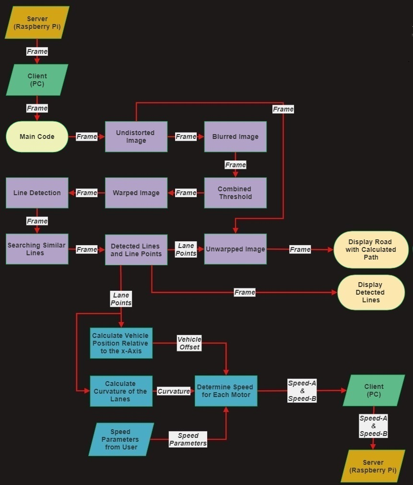
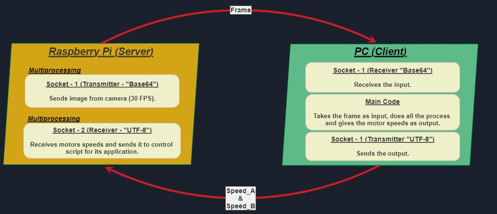

# Lane Tracking Car Project with Two Different Algorithms

A lane tracking car project with image processing and openCV. Contains two different algorithms and some usefull tools.

The basic algorithm works on Raspberry Pi 3B without a problem, the video was shot with this algorithm.

The advanced one needs much more processing power. In order to provide this processing power, an udp connection established to run on computer. However neither with the Raspberry Pi's Wi-Fi nor with the external Wi-Fi modules I was unable to get rid of communication delays.

### Advanced Algorithm Software Flow Chart

### Advanced Algorithm UDP Connection

## Vehicle Kit

#### OSOYOO Raspberry Pi V2.0 Car

This kit is **not** compatible at all for this project. I highly recommend you to buy a kit which have four wheels and a servo motor to control the steering angle. It's a nice kit but it made my work a lot difficult.

#### Raspberry Pi 3B

Has enough processing power for the basic algorithm, not enough for the advanced one.

#### Battery

Kit had came with two 18650 batteries but these batteries were insufficient. I replaced them with a 3S 2200mah Lipo battery which I had it from in my old projects.

#### Raspberry Pi Camera Module

Probably any compatible camera will do the work.
